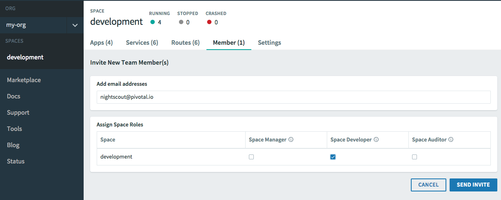
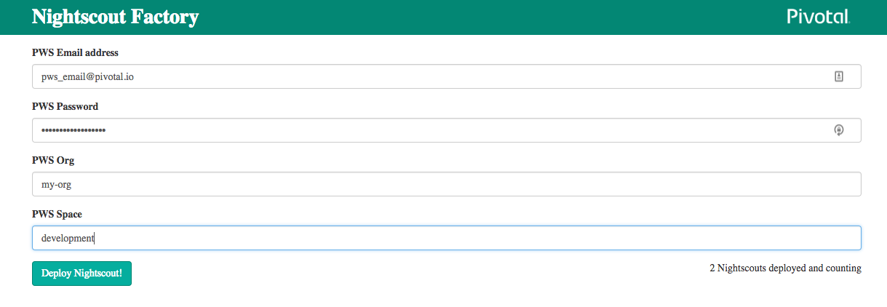
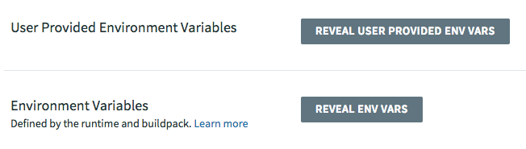
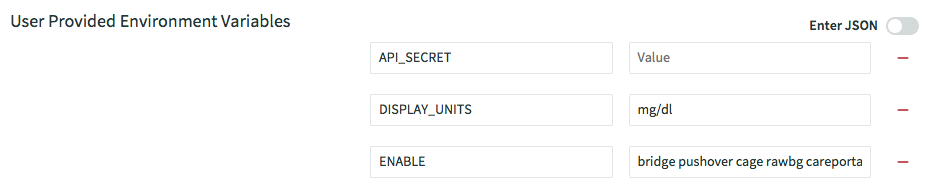
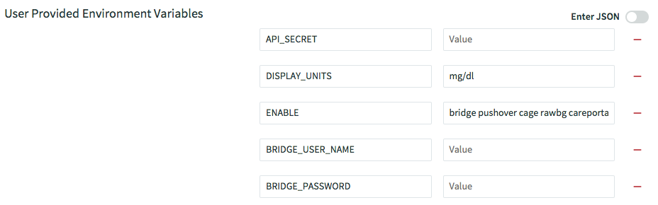
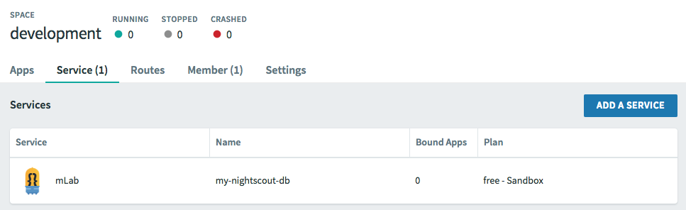
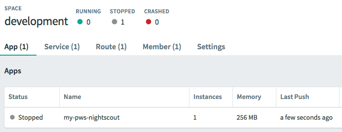
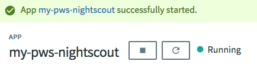

# Deploying Nightscout onto Pivotal Web Services

Pivotal Web Services (PWS) is a public cloud platform offered by [Pivotal Software, Inc](http://pivotal.io).

## Deploying nightscout automatically with `nightscout-factory`
The preferred method to get a nightscout on PWS is automatically via an app called `nightscout-factory`. The steps are simple:
1. Create an account in PWS to host your app
2. Add the `nightscout-factory` user to your Space for automation work
3. Fill in the few details needed at the `nightscout-factory` app
4. Review the settings for nightscout in PWS for your particular needs

### Creating An Account in PWS
To use PWS you must first create an account. You will receive a 2GB Org and a Trial Credit of $87, enough to run nightscout for the entire year at no cost.

Signups happen here: https://run.pivotal.io/
[Instructions](https://docs.run.pivotal.io/starting/index.html).

### Add A Space Developer To Your Org
In order to use the `nightscout-factory` automation you will need to grant the robot `Space Developer` access to your space in PWS.

Log into your PWS account, click on your space name on the left side of the screen and go to the `Members` page.



### Request An App via `nightscout-factory`
Once you have sent the invite for the `nightscout@pivotal.io` user to join your space, go to https://nightscout-factory.cfapps.io and enter your PWS email, PWS password, and the organization and space that you just invited the user to. Click `Deploy Nightscout!` and wait.  The whole process may take around 3 minutes.  Once finished, it will show you the URL of your newly deployed `nightscout` instance.



### Changing Nightscout Settings

In PWS, you can view the settings for your app by selecting the app in the Space the app resides in, clicking the app name and then choosing Settings. You will see User Provided Environment Variables about half way down the page. The settings for nightscout are here in Name / Value pairs. You need to set a few values first.



Here you will find the `ENABLE` variable, which turn on and off many features of the app. These features are well documented in [other places](https://github.com/nightscout/cgm-remote-monitor#plugins).

`API_SECRET` to set the admin secret for your site. Type in a secret now (it was blank in the manifest).



If you are using the `BRIDGE` feature, you'll also have:

`BRIDGE_USER_NAME` is the username in Dexcom Share site. Type in your username now.
<br>
`BRIDGE_PASSWORD` is the password for the above user name. Type in your username now.



Once these steps are complete, you are ready to run (or restart if running) your app and the follow the link to it for use.
### Process Complete!

## Deploying nightscout manually
To publish a nightscout site on PWS manually, you will follow the procedure here, in this order:

1. Fork the repo to get a copy of the app
2. Create an account in PWS to host your app
3. Create an instance of a database for the app to use
4. Install the `CF CLI` tool to talk to PWS
5. Login to PWS from the command line and point at where you want to place your app
6. Prepare your copy of nightscout to run in PWS
7. Deploy the nightscout app to PWS from the command line
8. Adjust any settings in nightscout needed prior to running it
9. Run the app and connect for the first time

## Forking The Repo
[Fork it](https://help.github.com/articles/fork-a-repo/)
## Creating An Account in PWS
To use PWS you must first create an account. You will receive a 2GB Org and a Trial Credit of $87. This should be enough to run nightscout for the entire year at no cost.

Follow [these instructions](https://docs.run.pivotal.io/starting/index.html) to create your account and then return here.

Signups happen here: https://run.pivotal.io/
## Create mLab MongoDB Service

PWS makes it really easy to get partner services for use with your apps. For nightscout, the app requires a database, which we get from MongoDB, who happens to be a member of the PWS Marketplace, among many others.

To get a free database instance for your app, follow these directions:

In Apps Manager (the PWS UI):
1. Log-in to your account and choose Marketplace from the left-hand column.
2. In the list of Services, scroll to "mLab, Fully managed MongoDB-as-a-Service" and click on it.
3. You should see one Service Tier: Sandbox free. Click the Select This Plan button.
4. Fill in the form that pops up:

`Instance Name` = a name for this database. It can be anything, like "my-nightscout-db".
<br>
`Add To Space` =  The name of the Space that your nightscout app resides in. This is probably Development, the default Space PWS gives you, unless you made a new Space for the app.
<br>
`Bind To App (Optional)` = The name you used for nightscout if you uploaded it already. If you haven't yet, that's OK, we will do that in the `manifest.yml` step or it can be bound later. This is a shortcut to putting useful info like the database URI into a variable the app can use.

5. Click on Create and it'll generate a database instance for you on Mongo's system and attach it to the Space you selected.
6. Make a note of the `Instance Name` you used as it'll be important in the next step. You're done!

You can confirm the results by going to the Space you selected on the left side, choosing Service which should have a (1) next to it and see an mLab Service in there with the name you used and Plan "free".


## Deploying the Nightscout Application
### Installing CF CLI

It's very helpful to have the CLI tools for PWS installed even if you don't use them much. This tool is required during installation and can be useful later.

Here are instructions for [installing the CF CLI](https://docs.run.pivotal.io/cf-cli/install-go-cli.html) tool for Mac, Windows and Linux. Please install it and return here. You will want to read the first part of the [Getting Started](https://docs.run.pivotal.io/cf-cli/getting-started.html) page as well, on how to `log in` and `cf push` with the CF CLI

Login Example: `cf login -a https://api.run.pivotal.io -u username@mail.com -p password -o Org-Name-You-Used -s development`

Quick test: type `cf help -a` for a list of commands. Type `cf target` to see what you are connected to.

### Preparing Your nightscout For PWS
Now we are ready to put a copy of nightscout in the cloud for your use. You will use a command line window to run a few simple commands to get this done. Most of the things nightscout needs are already in a text file you will include with the app when you send it to PWS. This text file is called `manifest.yml` and is a collection of named variables and values nightscout needs as well as a few things PWS can use to properly run the app. The `manifest.yml` file is mostly complete and only needs a little attention from you to get ready.

Want more reading? Here's a [PWS Sample App](https://docs.run.pivotal.io/buildpacks/ruby/sample-ror.html) example.

#### Preparing The Manifest

In your clone of the nighscout app, you will find a `manifest.yml` file. It's a text file with a certain formatting applied.

The first section looks like this:
```
## PWS information section
applications:
- name: my-pws-nightscout           ## <- REPLACE with a name for the app in PWS
  memory: 256M
  disk_quota: 512M
  instances: 1
```
Give your app a name unique to you, an important step because that name will also be the route to the app. In PWS every route must be unique. Anything will do, be creative. A great way to do this is insert a word and a number you choose, for example:
```
- name: doghouse-739-nightscout
```
The second section looks like this:
```
env:
  DISPLAY_UNITS: mg/dl
  API_SECRET:         ## <- REPLACE with a secret only you know! (Must be at least 12 characters long)
  ENABLE: bridge pushover cage rawbg careportal
####  Dexcom Bridge settings. Uncomment these (delete ##) if you are using the BRIDGE function of nightscout
##    BRIDGE_USER_NAME: dexcom-share-username
##    BRIDGE_PASSWORD: dexcom-share-password
##    BRIDGE_INTERVAL: 150000
```
At the very least, you need to consider two things:

`API_SECRET`: a secret password you will keep to administrate nightscout with (Must be at least 12 characters long)
<br>
`ENABLE`: a space-separated list of features (plugins) you want nightscout to run. A few common ones are already included. [Look here](https://github.com/nightscout/cgm-remote-monitor#plugins) for a much more complete list. Add more plugins now if you wish.

Open the `manifest.yml` file in a quality text editor such as Atom (Mac) or notepad++ (Windows). Keeping the formatting of the file is important.

Don't put a secret in the `API_SECRET` line just yet, we'll do that in the next step. This just creates the variable in PWS. Uncomment (delete the ##) `BRIDGE` lines if you are using the Dexcom Share bridge function and enter the appropriate Dexcom Share credentials (or leave them blank to be filled in later). Here's an example:
```
env:
  DISPLAY_UNITS: mg/dl
  API_SECRET:
  ENABLE: bridge pushover cage rawbg careportal
####  Dexcom Bridge settings. Uncomment these (delete ##) if you are using the BRIDGE function of nightscout
    BRIDGE_USER_NAME:
    BRIDGE_PASSWORD:
    BRIDGE_INTERVAL: 150000
```
The next section are clues for PWS about how to run your app.
```
services:
  - my-nightscout-db              ## <- REPLACE with the name you used when you create the mLab instance in the Marketplace. MUST match!
```
Enter the `Instance_Name` you used for mLab in the step above. This binds the database to the app in the Space.

OK, that's it! Save your `manifest.yml` file to disk as `text` and don't change the suffix `.yml`. This work will save you time in the next step and a lot later should you need to deploy nightscout again.
## Push The App!
Now it's time to put the app in the cloud. Navigate to the root of the app's files in your command line window. Looks something like this:

```
$ cd /Users/myUser/Documents/cgm-remote-monitor/
$ ls -l
total 1464
-rwx------  1 myUser  staff    5094 Aug 31 14:54 CONTRIBUTING.md
-rwx------  1 myUser  staff     157 Aug 31 14:54 COPYRIGHT
-rwx------  1 myUser  staff     261 Aug 31 14:54 Dockerfile.example
-rwx------  1 myUser  staff   34521 Aug 31 14:54 LICENSE
-rwx------  1 myUser  staff    3639 Aug 31 14:54 Makefile
...
```
You want yourself just inside the directory where you cloned `cgm-remote-monitor`. If you aren't there, you'll get an error from `cf` saying it can't find an app to push. Then, just do this:
```
$ cf push -f manifest.yml --no-start
```
...and a lot of magic happens. When it's done, you'll see this:


### Changing Nightscout Settings

In PWS, you can view the settings for your app by selecting the app in the Space the app resides in, clicking the app name and then choosing Settings. You will see User Provided Environment Variables about half way down the page. The settings for nightscout are here in Name / Value pairs. You need to set a few values first.


Here you will find the `ENABLE` variable, which turn on and off many features of the app. These features are well documented in [other places](https://github.com/nightscout/cgm-remote-monitor#plugins).

`API_SECRET` to set the admin secret for your site. Type in a secret now (it was blank in the manifest).


If you are using the `BRIDGE` feature, you'll also have:

`BRIDGE_USER_NAME` is the username in Dexcom Share site. Type in your username now.
<br>
`BRIDGE_PASSWORD` is the password for the above user name. Type in your username now.


## Run The App!
You are all prepared to run this app now. You may have noticed the `--no-start` flag on the `cf push` command, that means place the app but don't start it, because we needed to complete the api_secret/username/password step first. If the app is already running, you may want to restart it (use the circle arrow button) now.

In Apps Manager, open the app in the Space and click the play button (right carat) next to the app name. The Events column will have activity and you'll see a green dot next to Running when all is well. Shouldn't take but a minute or so.


## Using nightscout on PWS

Once your app is running and connected to the database, you can browse to the web view by following the Routes attached to the app. By default there will be one, the same as what you named the app. The easiest way to find this is to log in to PWS, click on the Space the app is in and click on the route highlighted next to it. This will open a new window with nightscout in setup mode.

Note that there is *No Reason* to run a keep-alive app the pings nightscout to keep it going. That's a shortcoming of other cloud environments such as Heroku. PWS runs apps 24x7 without interruption or quotas.

## Interesting PWS Features To Check out
In Setting for the app, you can change the app name. You can also delete the app in Settings.

In Overview, you can see the app's history and how long the app has been up, what it's consuming and there's a handy link to PCF Metric, where you can see graphs of the apps activity.

The Logs tab will let you easily tail the logs for the app if you want to see what it's up to. Note the "play button on the upper right corner to turn on the tail feature.
