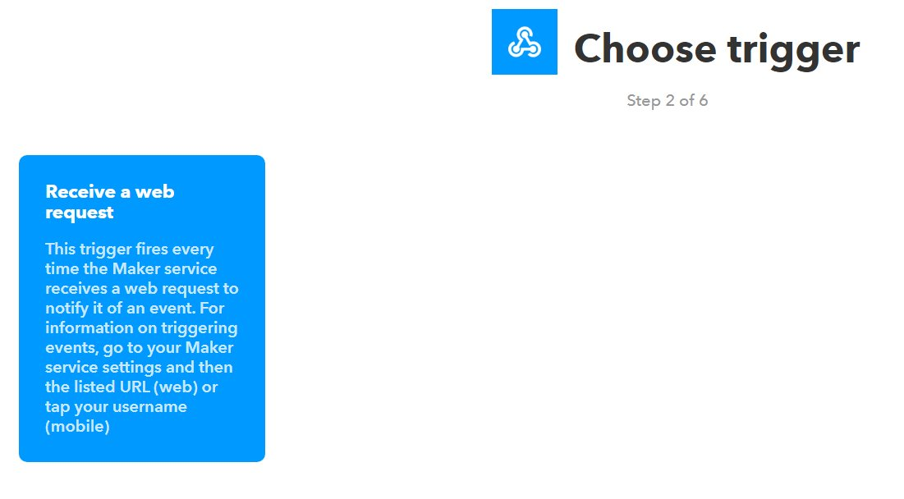
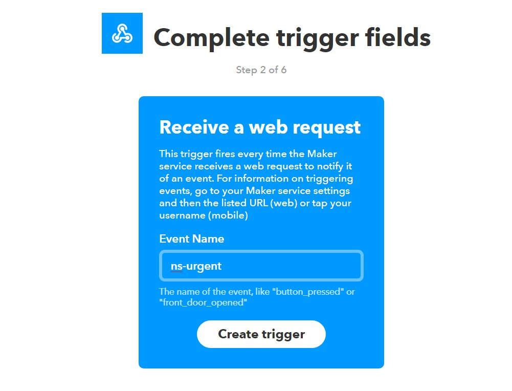
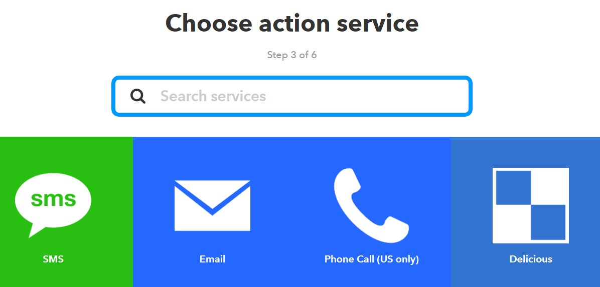

**Table of Contents**

- [Nightscout/IFTTT Maker](#nightscoutifttt-maker)
  - [Overview](#overview)
  - [Events](#events)
  - [Configuration](#configuration)
  - [Create a recipe](#create-a-recipe)
    - [1. Choose a Service](#1.-Choose-a-Service)
    - [2. Choose a Trigger](#2.-Choose-a-Trigger)
    - [3. Complete the Trigger Field](#3.-Complete-the-Trigger-Field)
    - [4. Selecting That](#4.-That)
    - [5. Choose an Action](#5.-Choose-an-Action)
    - [6. Connect Notifications](#6.-Connect-Notifications)
    - [7. Choose Notification Action Type](#7.-Choose-Notification-Action-Type)
    - [8. Edit the Message](#8.-Edit-the-Message)
    - [9. App Complete](#9.-App-Complete)
    - [10. Obtaining Maker Key](#10.-Obtaining-Maker-Key)
    -  [11. Adding Maker_Key](#11.-Adding-Maker_Key-to-Website)
    -  [12. Install Android IFTTT App](#12.-Install-Android-IFTTT-App)

Nightscout/IFTTT Maker
======================================

## Overview

 In addition to the normal web based alarms, and pushover, there is also integration for [IFTTT Maker](https://ifttt.com/maker).

 With Maker you are able to integrate with all the other [IFTTT Channels](https://ifttt.com/channels).  For example you can send a tweet when there is an alarm, change the color of hue light, send an email, send and sms, and so much more.

## Events

 Plugins can create custom events, but all events sent to maker will be prefixed with `ns-`.  The core events are:

  * `ns-event` - This event is sent to the maker service for all alarms and notifications.  This is good catch all event for general logging.
  * `ns-allclear` - This event is sent to the maker service when an alarm has been ack'd or when the server starts up without triggering any alarms.  For example, you could use this event to turn a light to green.
  * `ns-info` - Plugins that generate notifications at the info level will cause this event to also be triggered.  It will be sent in addition to `ns-event`.
  * `ns-warning` - Alarms at the warning level with cause this event to also be triggered.  It will be sent in addition to `ns-event`.
  * `ns-urgent` - Alarms at the urgent level with cause this event to also be triggered.  It will be sent in addition to `ns-event`.
  * `ns-warning-high` - Alarms at the warning level with cause this event to also be triggered.  It will be sent in addition to `ns-event` and `ns-warning`.
  * `ns-urgent-high` - Alarms at the urgent level with cause this event to also be triggered.  It will be sent in addition to `ns-event` and `ns-urgent`.
  * `ns-warning-low` - Alarms at the warning level with cause this event to also be triggered.  It will be sent in addition to `ns-event` and `ns-warning`.
  * `ns-urgent-low` - Alarms at the urgent level with cause this event to also be triggered.  It will be sent in addition to `ns-event` and `ns-urgent`.
  * `ns-info-treatmentnotify` - When a treatment is entered into the care portal this event is triggered.  It will be sent in addition to `ns-event` and `ns-info`.
  * `ns-warning-bwp` - When the BWP plugin generates a warning alarm.  It will be sent in addition to `ns-event` and `ns-warning`.
  * `ns-urgent-bwp` - When the BWP plugin generates an urgent alarm.  It will be sent in addition to `ns-event` and `ns-urget`.

## Configuration

  1. Setup IFTTT account at IFTTT.com: [login](https://ifttt.com/login) or [create an account](https://ifttt.com/join)  (use all lower case characters for email and password, it seems to work best)
  2. Follow the Creating an Applet instructions below.
  3. Configure Nightscout by setting these environment variables:
  * `ENABLE` - `maker` should be added to the list of plugin, for example: `ENABLE="maker"`.
  * `MAKER_KEY` - Set this to your secret key that you located in step 11 when you created the Applet, for example: `MAKER_KEY="abcMyExampleabc123defjt1DeNSiftttmak-XQb69p"`

## Create a Notification Applet at IFTTT.com for your Cell Phone

### Start Creating an Applet

### 1. Choose a Service

### 2. Choose a Trigger

### By clicking on the big blue box.   You want IFTTT to do something when it receives an event from Nightscout.

### 3. Complete the Trigger Field

### Enter one of the above listed events like "ns-urgent" (without the quotes)

  

  

### 4. That

### Click on the blue "that" to choose what you want to have happen when the even occurs.

  

### 5. Choose an Action

###### In this example we will send a notification to an Android phone

  

###### Search for Notifications and then click on the Bell Icon

### 6. Connect Notifications

​    

### 7. Choose Notification Action Type

###### For now, choose the basic notification type via the left blue block.

### 8. Edit the Message

### You can edit the message sent as a notification here, but you need to leave the EventName field in place.  Then Create the action.

### 9. App Complete

### If you see this you have completed your first applet and it is enabled! 

### 10. Obtaining Maker Key

### Next, click on My Applets on the top bar, then click on Services, and then click on the Webhooks icon.  

### Click on Settings in the top right corner and you will see something similar to this (not exactly the same).   

### Copy the text in the URL after "/use/"" and paste it someplace so you can access it later.  This is the "Maker_Key"   This text needs to go into Nightscout's Website, Settings, variables, Maker_Key.

  

### 11. Adding Maker_Key to Website

### In a Heroku.com website deployment, the Website, vars look like this:
### Make sure you have Enabled "Maker" in the Enable line as well.    

### 12. Install Android IFTTT App

### Next, you need to install the Android IFTTT app from the Play Store and log into it with you IFTTT password and ID.   Now, whenever an ns-urgent event occurs, Nightscout will send an event to IFTTT, then IFTTT will send a notification to your Android phone showing a ns-urgent notification and whatever text you configured in the message.  On my Android phone, my phone beeps and the message is displayed on the lock screen.  

  
